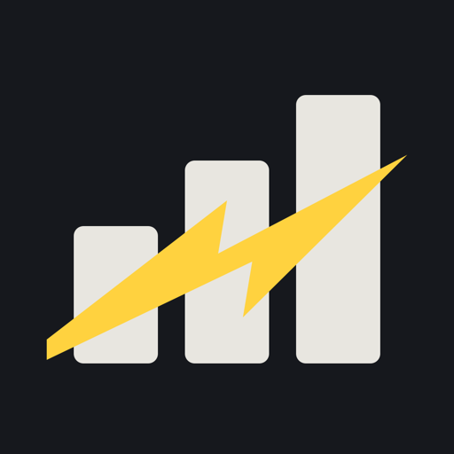

  
    

<h1 align="center">Brandon Sauceda</h1>

  Engineering Manager | Product-minded software leader | Gov-tech, geospatial, and Bitcoin systems

  <a href="https://saucy.tech">Website</a> |
  <a href="https://www.linkedin.com/in/saucytech/">LinkedIn</a> |
  <a href="https://github.com/saucy-tech">GitHub</a> |
  <a href="https://twitter.com/Saucy_Tech">X</a> |
  <a href="https://primal.net/p/nprofile1qqsvzs8gfntzjs2wg8670nrfy64h44zy69kc3r8rp5wd7kw6t6njsassf62c7">Nostr</a>

---

<h2 align="center">What I'm building</h2>

  Two products get almost all of my building time.

<table>
  <tr>
    <td width="50%" align="center">
      <a href="https://morningportion.com">
        <picture>
          <source media="(prefers-color-scheme: dark)" srcset="img/the-morning-portion-logo-dark.png" />
          
        </picture>
      </a>
    </td>
    <td width="50%" align="center">
      
    </td>
  </tr>
  <tr>
    <td align="center"><em>The Word, before the day gets loud.</em></td>
    <td align="center"><em>What to do now, what to log, what to do next time.</em></td>
  </tr>
  <tr>
    <td valign="top">
      Weekday scripture reflections rooted in the Sunday School lesson series. I write it and run the whole pipeline: an MDX publishing flow, an email broadcast to subscribers, and a podcast episode, out every weekday.
        
      <code>Next.js 16</code> <code>React 19</code> <code>MDX</code> <code>Tailwind</code> <code>Vercel</code>
        
      <a href="https://morningportion.com"><strong>Read it at morningportion.com</strong></a>
    </td>
    <td valign="top">
      The workout logger I use on the gym floor every training day. Local-first, so it keeps working with no signal and converges to Cloudflare KV through a commutative merge. No framework, no build step, no runtime dependencies.
        
      <code>Vanilla JS</code> <code>PWA</code> <code>Cloudflare Workers</code> <code>KV</code> <code>Offline-first</code>
        
      <a href="https://train-every-day-demo.brandonsauceda.workers.dev/"><strong>Open the demo</strong></a>
       
      The live app holds my own training record and stays private. The demo is a separately sanitized build with fabricated data.
    </td>
  </tr>
</table>

---

## About

I lead small engineering teams and ship software that solves operational problems for real people. My background spans product engineering, government technology, GIS, and modern web development, with a consistent focus on clarity, execution, and systems that are easier to maintain than the ones they replace.

I am most effective where product, engineering, and delivery overlap: shaping scope, improving team throughput, modernizing legacy workflows, and helping teams move from ambiguity to working software.

## What I Do

- Lead engineering work across planning, delivery, and continuous improvement
- Build product direction with a bias toward user value, maintainability, and measurable outcomes
- Modernize legacy and public-sector systems without losing operational context
- Design and ship web products using TypeScript, React, Next.js, Node.js, and Python
- Work comfortably in GIS and mapping-heavy environments with ArcGIS Online and ArcGIS Pro
- Explore Bitcoin and Lightning-native products with an emphasis on practical utility and self-sovereign tools

## Current Focus

- Engineering management for small, high-trust teams
- Product delivery in gov-tech and operationally complex environments
- AI-assisted workflows that improve execution without adding noise
- Bitcoin, Lightning, and local-first software patterns

## Other Projects

The two products above get the bulk of my time. These are the rest.

| Project | Summary | Stack |
| --- | --- | --- |
| **[Field Manual](https://github.com/saucy-tech/field-manual)** | Open-source Claude Code skill that turns a project into one HTML file you use to drive the agent: decision sections, owner-badged task board, copy-prompt chips, status-sync loop | `Claude Code` `HTML` `AI agents` |
| **[Personal Site](https://github.com/saucy-tech/personal-site)** | Portfolio and writing platform with Lightning payments, MDX content, and a strong focus on accessibility and performance | `Next.js` `React` `TypeScript` `Tailwind` `MDX` |
| **[Lightning Tip Jar](https://github.com/saucy-tech/lntipjar)** | Bitcoin tipping experience built around Nostr Wallet Connect for straightforward Lightning payments | `Next.js` `React` `TypeScript` `NWC` `@getalby/sdk` |
| **[Work Time Visualizer](https://github.com/saucy-tech/work-time-visualizer-rust)** | Lightweight Windows taskbar widget showing daily and weekly work-time progress bars, built with native Win32 API | `Rust` `Win32 API` `Cargo` |

## Open Source Contributions

| Project | Contribution |
| --- | --- |
| **[hubble.md](https://github.com/bholmesdev/hubble.md)** | Three merged PRs to the notepad I use daily: Windows desktop build support ([#115](https://github.com/bholmesdev/hubble.md/pull/115)), system-follow dark mode ([#147](https://github.com/bholmesdev/hubble.md/pull/147)), and workspace-switcher cleanup ([#196](https://github.com/bholmesdev/hubble.md/pull/196)) |
| **[neon-orbit](https://github.com/ATLBitLab/neon-orbit)** | Power-ups: repair, Overdrive, and Shield pods ([#6](https://github.com/ATLBitLab/neon-orbit/pull/6)) &middot; [play it](https://neon-orbit-eight.vercel.app/) |
| **[Warp](https://github.com/warpdotdev/warp)** | Repo-picker fix for multi-repo workflows ([#9451](https://github.com/warpdotdev/warp/pull/9451)) |
| **[Abbot](https://github.com/ATLBitLab/abbot)** | Core features for the Bitcoin/Lightning bot for Nostr and Telegram |

## Recognition

Work I led has been recognized by Esri, GMIS, and NASCIO:

- **Esri Special Achievement in GIS (SAG) Award** — 2020
- **GMIS G2B Award, Government to Business** — GMIS International + Georgia Chapter, 2019
- **NASCIO State IT Recognition Award, ICT Innovations** — national finalist, 2019
- **Legends of Lightning Vol. 2 Hackathon** — Community & Education Award, 2023

Full list on my [portfolio](https://saucy.tech/portfolio).

## Core Tools

**Languages** &middot; `TypeScript` `JavaScript` `Python` `Swift` `Rust` `C#` `PowerShell` `SQL`

**Web** &middot; `React` `Next.js` `Astro` `Node.js` `MDX` `Tailwind CSS` `Three.js`

**Platform** &middot; `Cloudflare Workers` `KV` `D1` `Vercel` `Azure` `Docker`

**Data & GIS** &middot; `MS SQL` `PostgreSQL` `ArcGIS Pro` `ArcGIS Online`

**Bitcoin** &middot; `Lightning Network` `Nostr Wallet Connect` `Nostr`

**AI tooling** &middot; `Claude Code` `MCP servers` `agent workflows`

## How I Work

- Keep teams aligned on the problem, not just the ticket queue
- Prefer simple systems, explicit tradeoffs, and steady delivery
- Use documentation and tooling to reduce repeated coordination cost
- Care about product quality, developer experience, and operational reliability together

## Connect

I am interested in thoughtful conversations around engineering leadership, product development, civic technology, geospatial systems, and Bitcoin-native software.
